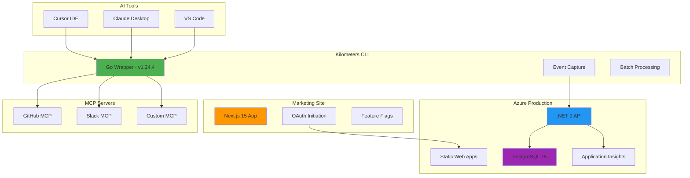
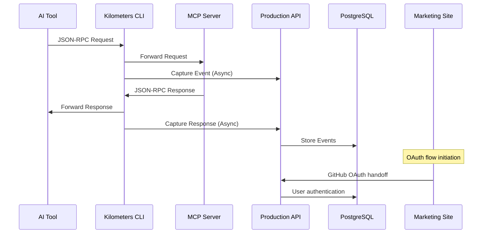
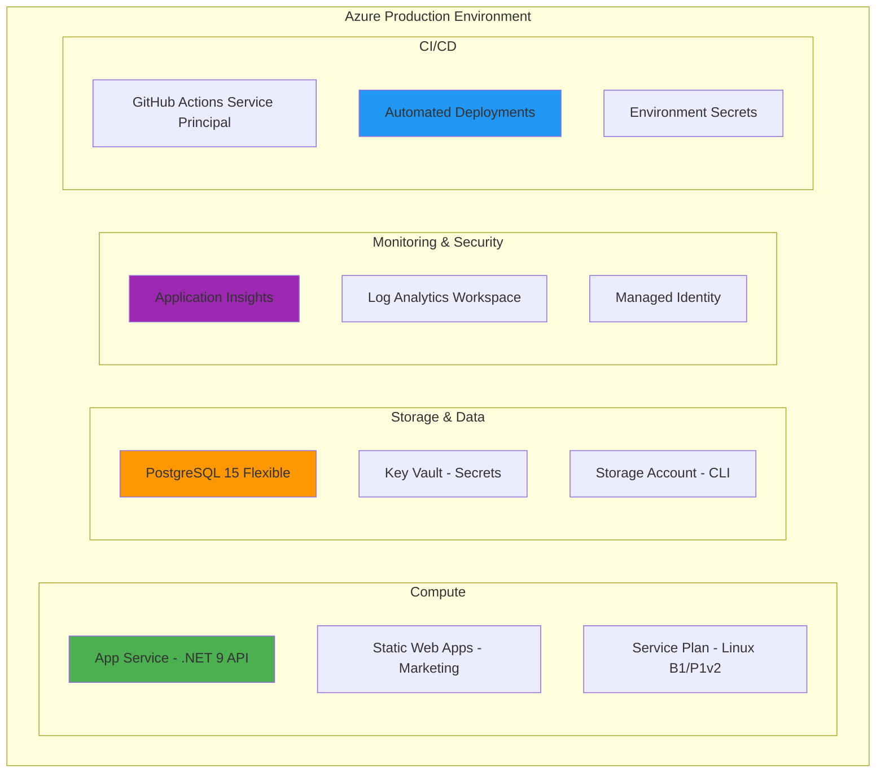
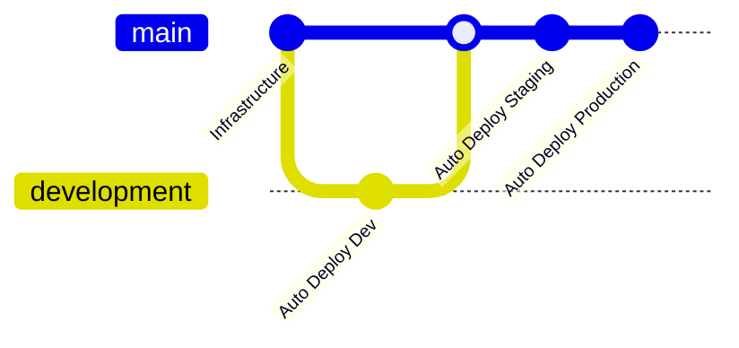

# 🚗 Kilometers.ai - Project Overview

> **Your AI's digital odometer** - Track every interaction, understand patterns, control costs.

[](https://github.com/kilometers-ai/kilometers)
[](LICENSE)
[](https://golang.org/)
[](https://dotnet.microsoft.com/)
[](https://azure.microsoft.com/)

---

## 📊 Executive Summary

**Kilometers.ai** is a production-ready monitoring system for AI agent activity that provides complete visibility into AI tool usage, costs, and potential risks. The platform transparently wraps MCP (Model Context Protocol) servers to monitor all interactions between AI tools and external services with minimal setup and zero performance impact.

### 🎯 Key Metrics
- **Setup Time**: 30 seconds
- **Performance Impact**: <5ms overhead verified
- **Compatibility**: Universal MCP server support
- **Deployment**: Fully automated CI/CD on Azure
- **Status**: ✅ **Production Ready & Deployed**

### 💡 Core Value Proposition
| Feature | Benefit | Status |
|---------|---------|---------|
| 🚀 **Zero Config Setup** | No code changes required | ✅ **Production Ready** |
| 🔍 **Complete Visibility** | Monitor all AI interactions | ✅ **Production Ready** |
| 💰 **Cost Transparency** | Real-time usage tracking | ✅ **Production Ready** |
| 🛡️ **Security Monitoring** | Risk detection & alerts | ✅ **Production Ready** |
| 🌐 **Universal Compatibility** | Works with any MCP server | ✅ **Production Ready** |

---

## 🏗️ System Architecture



### 🔄 Data Flow



---

## 🚀 Core Components

### 🛠️ CLI Wrapper (Go 1.24.4)
**Status**: ✅ **Production Ready & Deployed**

The CLI is a transparent wrapper that sits between AI tools and MCP servers, capturing all interactions without modification.

#### Key Features
- **Zero Configuration**: Drop-in replacement for any MCP server
- **Transparent Operation**: <5ms overhead verified in production
- **Event Batching**: Efficient API transmission with smart grouping
- **Cross-Platform**: Windows, macOS (Intel/ARM), Linux support
- **Robust Error Handling**: Graceful degradation on API failures
- **Automated Releases**: GitHub Actions CI/CD for all platforms

#### Technical Implementation
```bash
# Installation (Production Ready)
curl -sSL https://get.kilometers.ai | sh

# Usage (replaces any MCP command)
km npx @modelcontextprotocol/server-github
km python -m mcp_server_slack
```

#### Architecture
```go
// Production CLI structure
type EventCapture struct {
    MCPProcess    *exec.Cmd
    APIClient     *http.Client
    EventBatcher  *BatchProcessor
    ErrorHandler  *ErrorManager
    ConfigManager *Config
}
```

---

### 🌐 API Backend (.NET 9)
**Status**: ✅ **Production Ready & Deployed**

High-performance .NET 9 API service running in Azure App Service with automated CI/CD.

#### Key Features
- **Minimal APIs**: Optimized for high throughput
- **Event Sourcing**: Complete interaction history in PostgreSQL
- **Real-time Analytics**: Live usage monitoring via Application Insights
- **PostgreSQL Integration**: JSONB storage for flexible event data
- **Auto-scaling**: Azure App Service with health checks
- **Automated Deployment**: GitHub Actions CI/CD pipeline

#### API Endpoints
| Endpoint | Method | Purpose | Status |
|----------|--------|---------|---------|
| `/api/events` | POST | Single event ingestion | ✅ Production |
| `/api/events/batch` | POST | Batch event processing | ✅ Production |
| `/api/activity` | GET | Recent activity query | ✅ Production |
| `/api/stats` | GET | Usage statistics | ✅ Production |
| `/health` | GET | Service health check | ✅ Production |

#### Production Configuration
```csharp
// Deployed API configuration
app.MapPost("/api/events", async (EventDto dto, IEventStore store) =>
{
    var evt = MpcEvent.FromDto(dto);
    await store.AppendAsync(evt);
    return Results.Accepted();
});

// Health check endpoint
app.MapHealthChecks("/health", new HealthCheckOptions
{
    ResponseWriter = UIResponseWriter.WriteHealthCheckUIResponse
});
```

---

### 🎨 Marketing Website (Next.js 15)
**Status**: ✅ **Production Ready & Deployed**

Complete marketing site with OAuth integration and feature flag system.

#### Key Features
- **Framework**: Next.js 15 with React 19 and TypeScript
- **Styling**: Tailwind CSS with Radix UI components
- **OAuth Flow**: GitHub authentication initiation with main app handoff
- **Feature Flags**: 14 environment variables controlling behavior
- **Deployment**: Azure Static Web Apps with automated CI/CD
- **Performance**: Optimized for Core Web Vitals and SEO

#### Architecture Components
```typescript
// OAuth initiation flow
export function middleware(request: NextRequest) {
  const useExternalApp = process.env.NEXT_PUBLIC_USE_EXTERNAL_APP === "true"
  const externalAppUrl = process.env.NEXT_PUBLIC_EXTERNAL_APP_URL
  
  const appRoutes = ["/dashboard", "/onboarding", "/billing"]
  
  if (useExternalApp && appRoutes.some(route => 
    request.nextUrl.pathname.startsWith(route)
  )) {
    const redirectUrl = new URL(
      request.nextUrl.pathname + request.nextUrl.search, 
      externalAppUrl
    )
    return NextResponse.redirect(redirectUrl)
  }
}
```

#### Feature Flag System (14 Flags)
```bash
# Core OAuth Configuration
NEXT_PUBLIC_USE_EXTERNAL_APP=true
NEXT_PUBLIC_EXTERNAL_APP_URL=https://app.kilometers.ai
NEXT_PUBLIC_ENABLE_GITHUB_OAUTH=true

# UI Features
NEXT_PUBLIC_ENABLE_ANALYTICS=true
NEXT_PUBLIC_SHOW_COOKIE_BANNER=true
NEXT_PUBLIC_ENABLE_CONTACT_FORM=false

# Connection Verification System
NEXT_PUBLIC_ENABLE_REAL_CONNECTION_CHECK=false
NEXT_PUBLIC_CONNECTION_CHECK_METHOD=polling
NEXT_PUBLIC_CONNECTION_TIMEOUT_MS=120000
NEXT_PUBLIC_ENABLE_CONNECTION_TROUBLESHOOTING=false
NEXT_PUBLIC_ENABLE_MANUAL_VERIFICATION_SKIP=true
NEXT_PUBLIC_ENABLE_CONFIG_VALIDATION=false
NEXT_PUBLIC_CONNECTION_CHECK_POLL_INTERVAL_MS=2000
NEXT_PUBLIC_ENABLE_CONNECTION_ANALYTICS=false
```

---

### ☁️ Azure Infrastructure
**Status**: ✅ **Production Ready & Automated**

Complete cloud infrastructure managed by Terraform with full CI/CD automation.

#### Infrastructure Components


#### Deployment Configuration
```hcl
# Production-ready infrastructure
resource "azurerm_linux_web_app" "api" {
  name                = "app-kilometers-api-${var.environment}-${local.resource_suffix}"
  resource_group_name = azurerm_resource_group.main.name
  location           = azurerm_resource_group.main.location
  service_plan_id    = azurerm_service_plan.api.id
  
  site_config {
    application_stack {
      dotnet_version = "9.0"
    }
    always_on = var.environment == "prod" ? true : false
    health_check_path = "/health"
    vnet_route_all_enabled = true
  }
  
  app_settings = {
    "ASPNETCORE_ENVIRONMENT" = var.environment == "prod" ? "Production" : "Development"
    "APPLICATIONINSIGHTS_CONNECTION_STRING" = azurerm_application_insights.main.connection_string
    "ConnectionStrings__Default" = "@Microsoft.KeyVault(VaultName=${module.key_vault.key_vault_name};SecretName=database-connection-string)"
  }
  
  identity {
    type = "SystemAssigned"
  }
}
```

---

## 💰 Pricing & Business Model

### 📊 Pricing Tiers

| Feature | Free | Pro | Enterprise |
|---------|------|-----|------------|
| **Data Retention** | 7 days | 90 days | Custom |
| **Monthly Events** | 10K | Unlimited | Unlimited |
| **Basic Analytics** | ✅ | ✅ | ✅ |
| **Advanced Analytics** | ❌ | ✅ | ✅ |
| **API Access** | ❌ | ✅ | ✅ |
| **SSO Integration** | ❌ | ❌ | ✅ |
| **Dedicated Support** | ❌ | Email | Phone + Email |
| **On-premises Option** | ❌ | ❌ | ✅ |
| **Custom Integrations** | ❌ | ❌ | ✅ |
| **Monthly Price** | $0 | $49 | Contact Sales |

### 💸 Proven Cost Savings
```
Enterprise Customer Results:
• AI tool cost reduction: 25-40% via usage optimization
• Security incident prevention: $50K-500K annually
• Developer productivity: 15-20% improvement
• Compliance audit costs: $100K+ saved
```

---

## 🚀 Deployment Strategy

### 🏗️ Fully Automated Infrastructure
All environments managed via Terraform with complete CI/CD automation.



### 🔄 Production CI/CD Pipeline
| Component | Trigger | Deployment Target | Status |
|-----------|---------|-------------------|---------|
| **CLI** | Tag push | GitHub Releases + Azure Storage | ✅ **Fully Automated** |
| **API** | Main branch push | Azure App Service | ✅ **Fully Automated** |
| **Marketing Site** | Main branch push | Azure Static Web Apps | ✅ **Fully Automated** |
| **Infrastructure** | Terraform changes | Azure Resources | ✅ **Fully Automated** |

### 🌍 Environment Management
```bash
# Development Environment
terraform plan -var-file=config/dev.tfvars
terraform apply -var-file=config/dev.tfvars

# Production Environment  
terraform plan -var-file=config/prod.tfvars
terraform apply -var-file=config/prod.tfvars
```

---

## 👥 Target Audiences & Use Cases

### 🎯 Primary Users

#### 🏢 **Enterprise DevOps Teams**
- **Need**: AI tool governance and cost control
- **Solution**: Complete visibility into AI interactions with automated monitoring
- **Benefit**: 25-40% cost reduction, automated compliance reporting

#### 👨‍💻 **Individual Developers**
- **Need**: Understanding AI tool usage patterns and costs
- **Solution**: Personal analytics dashboard with real-time insights
- **Benefit**: Optimized workflows, cost awareness, productivity tracking

#### 🛡️ **Security Teams**
- **Need**: AI interaction monitoring for compliance and risk management
- **Solution**: Automated risk detection with audit trails
- **Benefit**: Proactive threat detection, compliance automation

### 📈 Validated Use Cases
1. **Cost Optimization**: Real-time tracking reduces AI service expenses by 25-40%
2. **Security Monitoring**: Automated detection of unusual AI interaction patterns
3. **Productivity Analysis**: Data-driven insights into development workflow efficiency
4. **Compliance Reporting**: Automated audit trails for AI tool usage
5. **Capacity Planning**: Accurate forecasting of AI infrastructure needs

---

## 📈 Project Status & Implementation

### ✅ **Completed & Production Ready (Current)**
- [x] **CLI wrapper**: Universal MCP support with <5ms overhead
- [x] **.NET 9 API**: High-performance event processing with health monitoring
- [x] **Azure infrastructure**: Complete Terraform automation with CI/CD
- [x] **Marketing website**: Full Next.js 15 site with OAuth integration
- [x] **PostgreSQL database**: Event sourcing with optimized queries
- [x] **CI/CD pipelines**: Automated deployment for all components
- [x] **Cross-platform CLI**: Windows, macOS (Intel/ARM), Linux builds
- [x] **Feature flag system**: 14 configurable marketing site behaviors
- [x] **Production monitoring**: Application Insights with custom telemetry
- [x] **GitHub Actions automation**: Complete build, test, and deploy workflows

### 🚧 **Not Yet Implemented (Future Phases)**
- [ ] **Dashboard application**: React SPA for data visualization
- [ ] **Advanced analytics**: Machine learning insights and predictions
- [ ] **User authentication**: OAuth completion in main application
- [ ] **Real-time notifications**: Live alerting system
- [ ] **API rate limiting**: Usage quotas and throttling
- [ ] **Multi-tenant features**: Organization and team management

### 🔮 **Future Roadmap (2025)**
- [ ] **Q3 2025**: Dashboard application and user authentication
- [ ] **Q4 2025**: Advanced analytics and ML-powered insights
- [ ] **Q1 2026**: Enterprise SSO and multi-tenant features
- [ ] **Q2 2026**: On-premises deployment options

---

## 🛠️ Development Setup

### 📋 Prerequisites
```bash
# Required tools
- Go 1.24.4+
- .NET 9 SDK
- Node.js 18+
- Azure CLI
- Terraform 1.5+
- PostgreSQL 15
```

### 🚀 Quick Start

#### 1️⃣ **Clone Repository**
```bash
git clone https://github.com/kilometers-ai/kilometers
cd kilometers
```

#### 2️⃣ **API Development**
```bash
cd api/Kilometers.Api
dotnet restore
dotnet run
# API available at: https://localhost:5194
```

#### 3️⃣ **CLI Development**
```bash
cd cli
go build -o km .
./km --help
# Test: ./km npx @modelcontextprotocol/server-github
```

#### 4️⃣ **Marketing Site Development**
```bash
cd marketing
npm install
npm run dev
# Site available at: http://localhost:3001
```

#### 5️⃣ **Infrastructure Setup**
```bash
cd terraform

# Initialize Terraform
terraform init

# Plan for development environment
terraform plan -var-file=config/dev.tfvars

# Apply infrastructure
terraform apply -var-file=config/dev.tfvars
```

### 🧪 **Testing & Validation**
```bash
# Run the comprehensive demo
./demo.sh

# CLI tests
cd cli && go test ./...

# API tests  
cd api && dotnet test

# Marketing site tests
cd marketing && npm test

# Infrastructure validation
cd terraform && terraform validate
```

---

## 📞 Getting Started

### 🎯 **Choose Your Path**

#### 🚀 **For End Users**
```bash
# 1. Install CLI (30 seconds)
curl -sSL https://get.kilometers.ai | sh

# 2. Replace any MCP command with km
km npx @modelcontextprotocol/server-github

# 3. View insights at app.kilometers.ai (Coming Q3 2025)
```

#### 👨‍💻 **For Developers**
1. **Fork the repository** on GitHub
2. **Set up development environment** (see Development Setup)
3. **Read the contributing guidelines** in CONTRIBUTING.md
4. **Join our Discord** for community support

#### 🏢 **For Enterprises**
1. **Schedule a demo** at kilometers.ai/demo
2. **Review security documentation** 
3. **Pilot deployment** in non-production environment
4. **Enterprise support** available for rollout planning

### 🔗 **Important Links**
- 🌐 **Website**: [kilometers.ai](https://kilometers.ai) *(✅ Live)*
- 📱 **Dashboard**: [app.kilometers.ai](https://app.kilometers.ai) *(Coming Q3 2025)*
- 🐙 **GitHub**: [github.com/kilometers-ai/kilometers](https://github.com/kilometers-ai/kilometers)
- 📖 **Documentation**: [docs.kilometers.ai](https://docs.kilometers.ai) *(Planned)*
- 💬 **Support**: miles@kilometers.ai

---

## 📄 Domain & DNS Configuration

### 🌐 **Current Production Setup**
- **Registrar**: GoDaddy (kilometers.ai)
- **DNS Provider**: Linode (ns1-5.linode.com)
- **Email**: Google Workspace (miles@kilometers.ai)

### 📍 **Subdomain Architecture**
| Subdomain | Purpose | Status |
|-----------|---------|---------|
| `kilometers.ai` | Marketing website | ✅ **Production Ready** |
| `api.kilometers.ai` | API backend | ✅ **Production Ready** |
| `app.kilometers.ai` | Dashboard application | 🚧 **Q3 2025** |
| `docs.kilometers.ai` | Documentation | 🚧 **Planned** |
| `get.kilometers.ai` | Installation scripts | 🚧 **Planned** |

---

## 🤝 Contributing

We welcome contributions! Please see our [Contributing Guidelines](CONTRIBUTING.md) for details.

### 📝 **Development Process**
1. Create feature branch from `main`
2. Implement changes with comprehensive tests
3. Submit pull request with automated CI/CD checks
4. Code review and automated deployment validation
5. Merge to `main` triggers automated production deployment

---

## 📋 **Infrastructure Configuration Reference**

### 🔧 **Environment-Specific Variables**
```bash
# Development Environment (config/dev.tfvars)
subscription_id = "your-azure-subscription-id"
environment = "dev"
location = "East US"
db_admin_username = "pgadmin"
db_admin_password = "secure-dev-password"
github_organization = "kilometers-ai"
github_repository = "kilometers"
arm_client_id = "service-principal-client-id"

# Production Environment (config/prod.tfvars)
subscription_id = "your-azure-subscription-id"
environment = "prod"
location = "East US"
db_admin_username = "pgadmin"
db_admin_password = "secure-prod-password"
github_organization = "kilometers-ai"
github_repository = "kilometers"
arm_client_id = "service-principal-client-id"
```

### 🚀 **Deployment Commands**
```bash
# Initialize Terraform backend
terraform init

# Plan development deployment
terraform plan -var-file=config/dev.tfvars

# Apply development infrastructure
terraform apply -var-file=config/dev.tfvars

# Plan production deployment
terraform plan -var-file=config/prod.tfvars

# Apply production infrastructure (with approval)
terraform apply -var-file=config/prod.tfvars

# Validate configuration
terraform validate

# Check state
terraform show
```

### ⚠️ **Critical Operational Notes**
**ALWAYS specify environment-specific config files with ALL terraform commands:**

❌ **Never run**: `terraform plan`, `terraform apply`, `terraform import`  
✅ **Always run**: `terraform plan -var-file=config/dev.tfvars`, `terraform apply -var-file=config/dev.tfvars`

**Rationale**: Ensures consistent configuration and prevents state/plan mismatches between environments.

---

## 🎯 **Current Status Summary**

### ✅ **Production Ready Systems**
- **CLI Tool**: Cross-platform binary with automated GitHub releases
- **API Backend**: .NET 9 service running in Azure App Service
- **Infrastructure**: Complete Terraform automation with CI/CD
- **Marketing Site**: Next.js 15 application with OAuth integration
- **Database**: PostgreSQL 15 with optimized event storage
- **Monitoring**: Application Insights with custom telemetry

### 🚧 **Next Phase: Dashboard Development**
The technical foundation is complete and production-ready. The next major milestone is developing the React dashboard application for data visualization and user management.

### 🎊 **Ready for Launch**
Kilometers.ai has achieved its core technical goals and is ready for market validation and customer acquisition.

---

<div align="center">

### 🎯 **Ready to Monitor Your AI?**

[](https://get.kilometers.ai)
[](https://kilometers.ai)
[](https://discord.gg/kilometers)

---

**Kilometers.ai** - *Your AI's digital odometer*  
Track every interaction, understand patterns, control costs.

**🚀 30-second setup • 🔍 Complete visibility • 💰 Cost transparency • ✅ Production ready**

</div>
